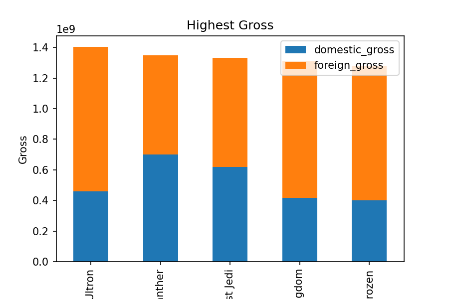
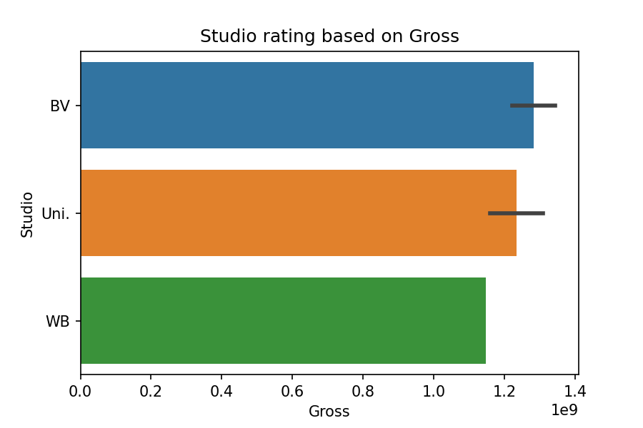

# IMDB Movie Data analysis

**Author**: Sainath Vineeth Raju Putta

## Overview

This project analyzes the data sourced from Academy XI which is IMDB movies which gives information about movies from 2010 to 2018. Descriptive analysis of movie gross and ratings shows the money made domestic or internation. We can use this analysis to choose which studio are the best and make high rated movies.

## Business Problem

Top movies can be made with highest revenue using this data analysis by choosing are the movies supposed to be launched domestic or international, how does the movie rating effect the money made by movies and the best studios which make the movies. Based on this analysis, business in movies can be more productive.

***

## Data

IMDB movie data sets are been sourced by Academy XI to me where they are mutiple data sets and cointains unique keys to connect to each other with tconst id, year, title.
***

## Methods

The missing values cant be retrieved as the data has been sourced from Acadamey XI, either cant source it from internet as they are many sources and different data and need to be drop all the missing data.


***

## Results

As we can see tho its the top movies or least movies, they make more profit internationally than domestic.
***

Here is an example of how to embed images from your sub-folder:

### Visual 1


Through this plot we can clearly say Rating does play a crucial role in making profits from movies.¶
***

### Visual 2


Trying to find which studio is best and makes the highest amount of profit overall.
***

### Visual 3


## Conclusions

This analysis leads to three recommendations for making profits in movie industry:

* High rated movies give the highest profits
* More International need to be made than just domestic movies for higher returns
* Studio BV is the highest rated, so making movies with BV is highly profitable.
***

## For More Information

Please review our full analysis in [our Jupyter Notebook](./dsc-phase1-project-template.ipynb) or our [presentation](./DS_Project_Presentation.pdf).

For any additional questions, please contact **Sainath Vineeth Raju Putta, vineeth810@gmail.com**

## Repository Structure

Describe the structure of your repository and its contents, for example:

```
├── README.md                           <- The top-level README for reviewers of this project
├── dsc-phase1-project-template.ipynb   <- Narrative documentation of analysis in Jupyter notebook
├── DS_Project_Presentation.pdf         <- PDF version of project presentation
├── data                                <- Both sourced externally and generated from code
└── images                              <- Both sourced externally and generated from code
```
